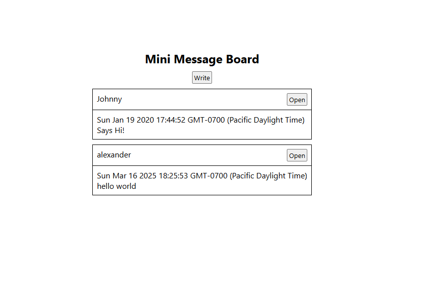

# Mini Message Board

## Description

A message board with minimal styling. The purpose of this project is to demonstrate the use of backend technologies such as Node.js, Express, EJS, and PostgreSQL.

Database is hosted on [Railway](https://railway.com/).

## Features

- Dynamic HTML
- MVC pattern
- Data persistence

## Installation

1. **Fork the Repository**

    - Follow the documentation on GitHub to [fork this repository](https://docs.github.com/en/pull-requests/collaborating-with-pull-requests/working-with-forks/fork-a-repo).  

    - You should also have a local clone of the forked repository after following the tutorial.

2. **Move to the cloned directory**

    ``cd mini-message-board``

3. **Install Dependencies**

    ``npm install``

4. **Start the server**

    ``node app.js``

5. **Preview the application**

    Open your browser and go to <http://localhost:3000>.

## Contribute

- Issue Tracker: github.com/jayyzzeezzy/mini-message-board/issues
- Source Code: github.com/jayyzzeezzy/mini-message-board.git

## Support

Let me know if you encounter any issues.  
Email me at: <jam9es@gmail.com>

## License

The project is licensed under the [MIT license](LICENSE.md).
